# 🏗️ ARCHITECTURE.md - Arquitectura del Sistema

> Arquitectura técnica y diagramas del sistema WhatsAppBot  
> Fecha: 2026-04-27

---

## 1. Visión de Componentes

### 1.1 Diagrama de Arquitectura General

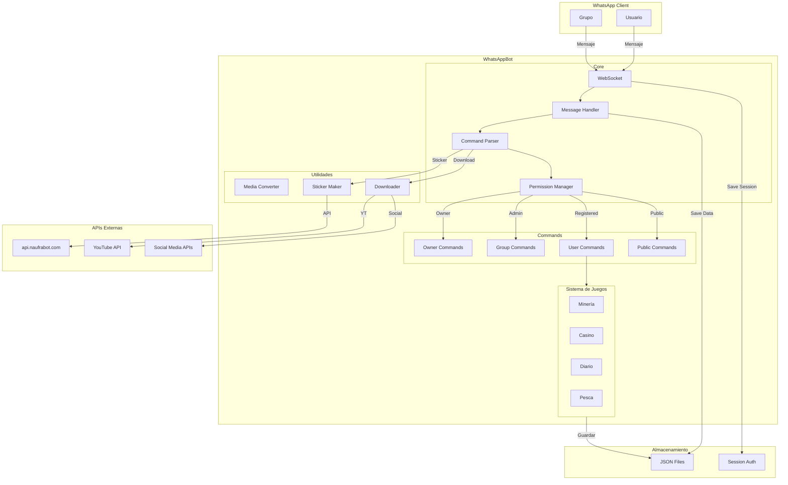

---

## 2. Arquitectura de Mensajería

### 2.1 Flujo de Procesamiento de Mensajes

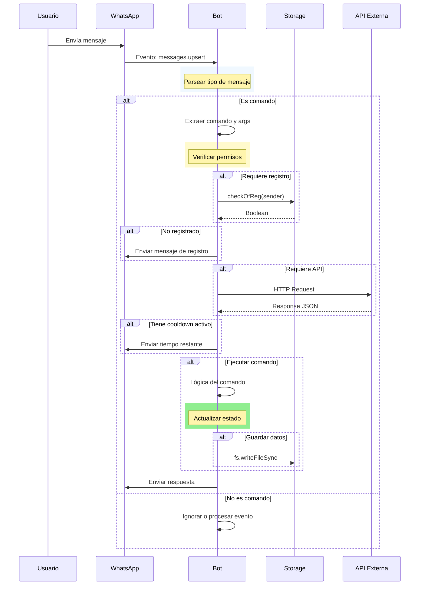

---

## 3. Modelo de Datos

### 3.1 Estructura de Usuario (ERD)

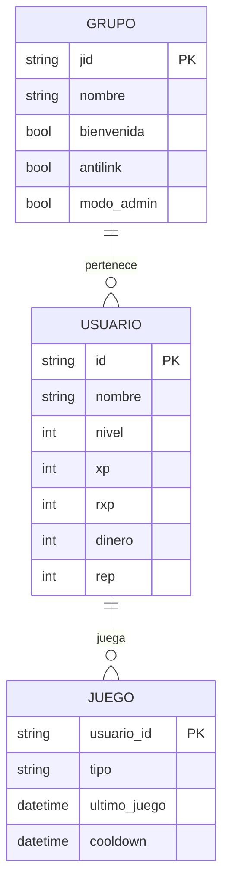

### 3.2 Modelo de Registro

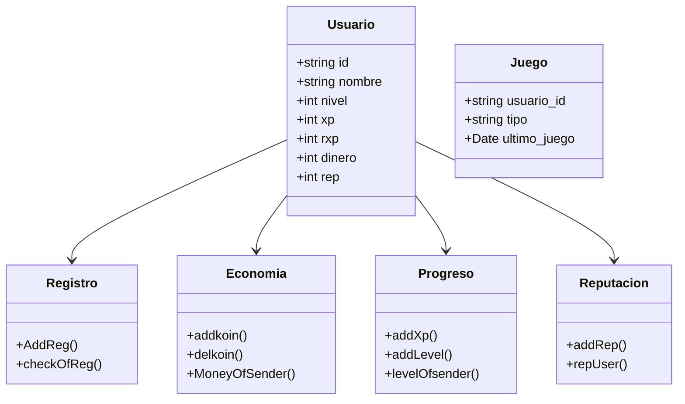

---

## 4. Sistema de Juegos

### 4.1 Diagrama de Estados - Juegos

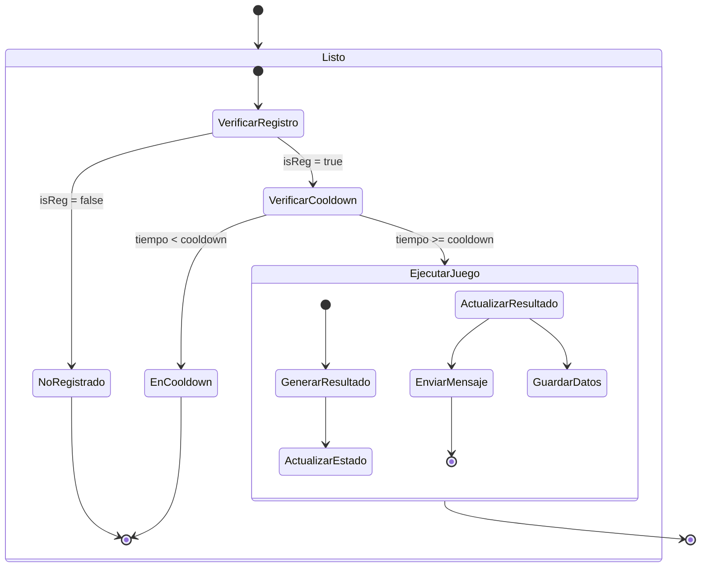

### 4.2 Diagrama de Flujo - Juegos

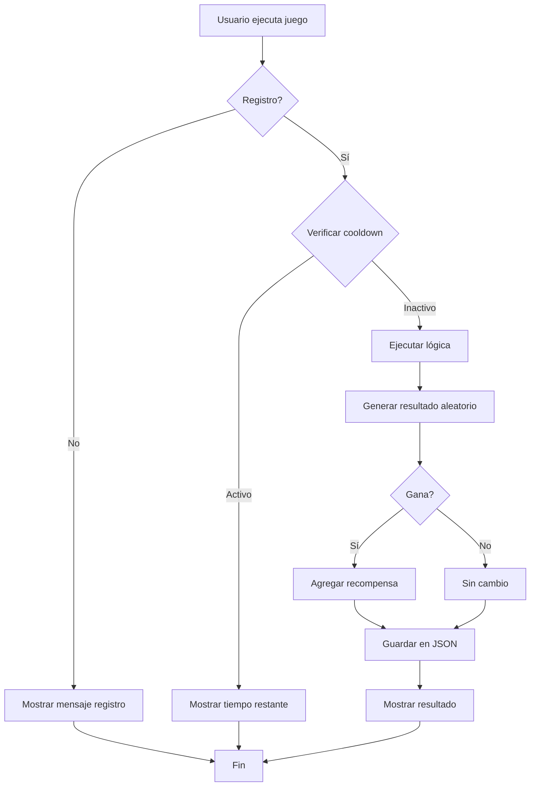

---

## 5. Gestión de Grupos

### 5.1 Diagrama de Permisos de Grupo

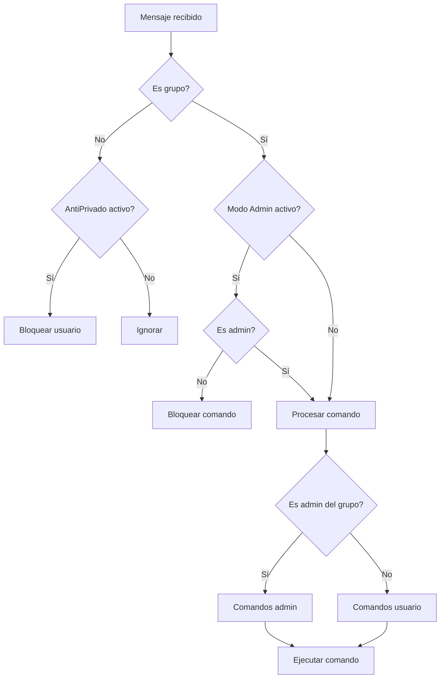

### 5.2 Configuraciones de Grupo

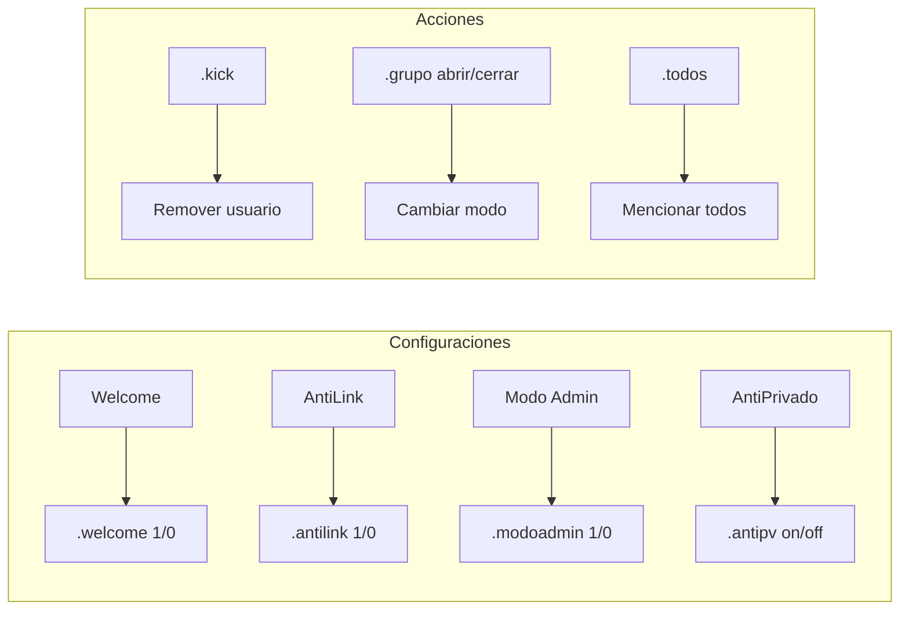

---

## 6. Sistema de Comandos

### 6.1 Jerarquía de Comandos

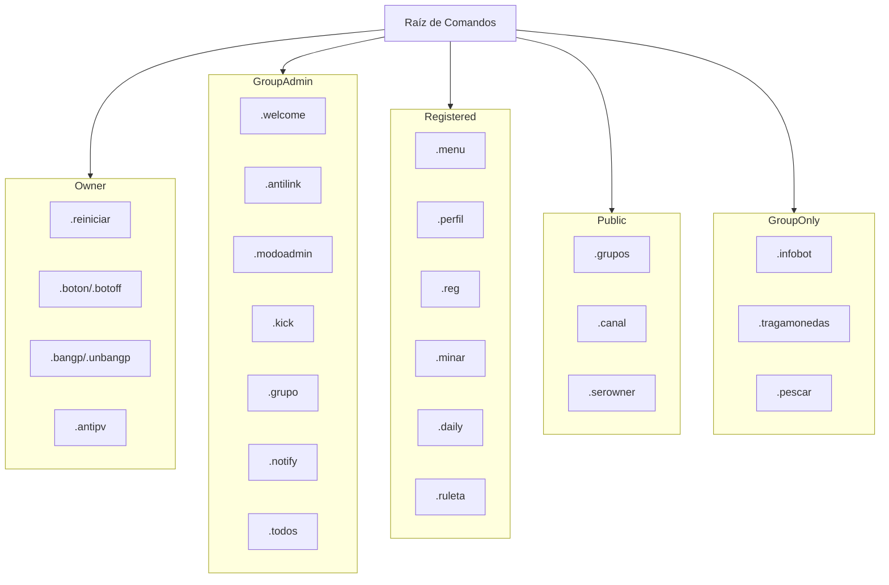

---

## 7. Integración con APIs

### 7.1 Flujo de Descargas

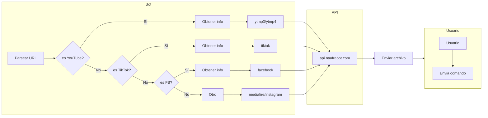

### 7.2 Sistema de Sticker

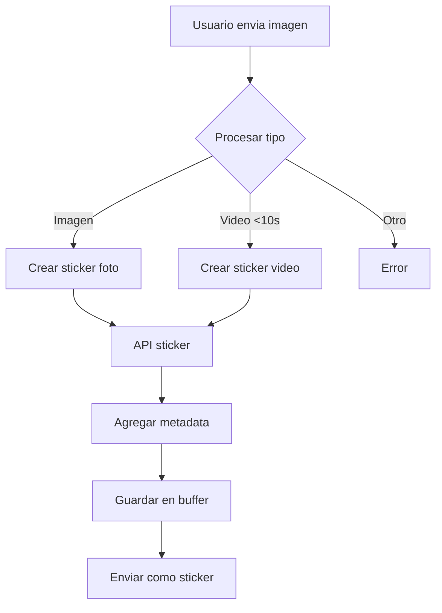

---

## 8. Arquitectura de Seguridad

### 8.1 Control de Acceso

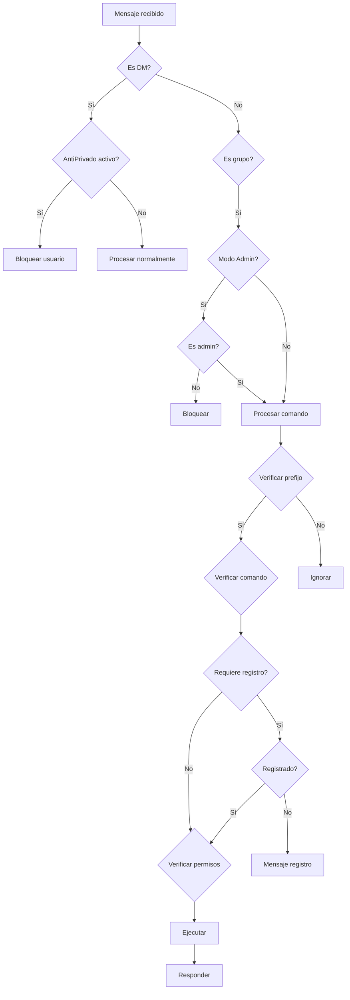

---

## 9. Persistencia

### 9.1 Flujo de Datos

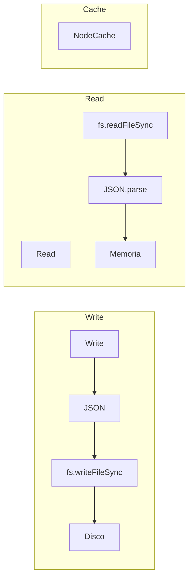

---

## 10. Resumen de Architecture

| Componente | Tecnología | Propósito |
|-----------|-----------|----------|
| WhatsApp Protocol | Baileys 6.7.21 | Conexión WhatsApp |
| Message Handler | Custom | Procesamiento de mensajes |
| Command Parser | Switch/Case | Enrutamiento de comandos |
| Persistence | JSON Files | Almacenamiento |
| External APIs | HTTP/Axios | Descargas y AI |

---

*Diagrams generated with Mermaid - 2026*