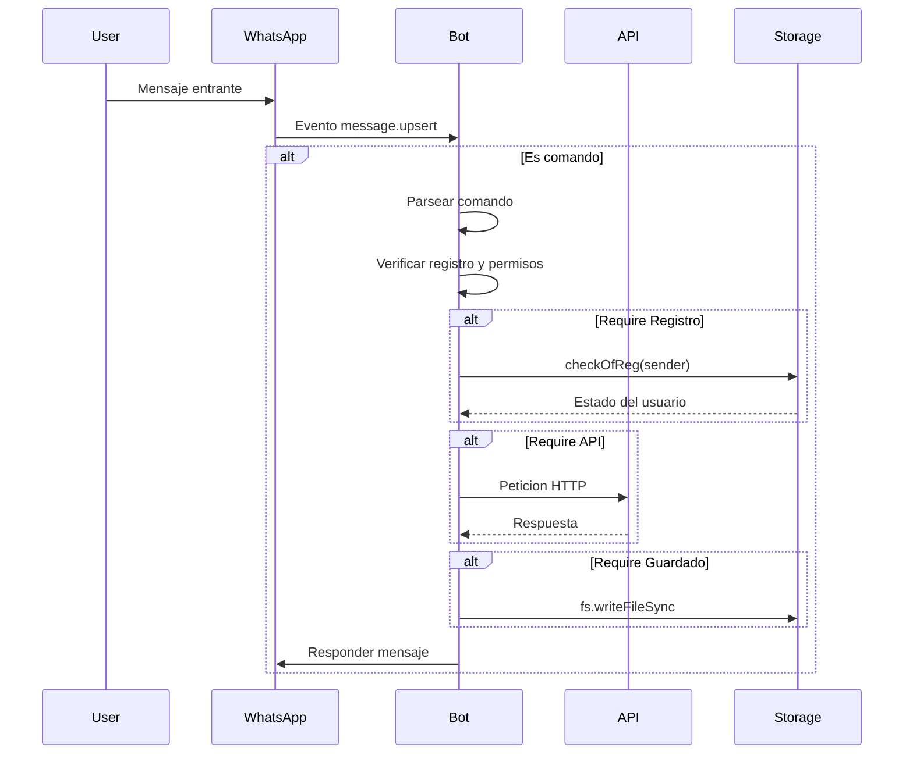
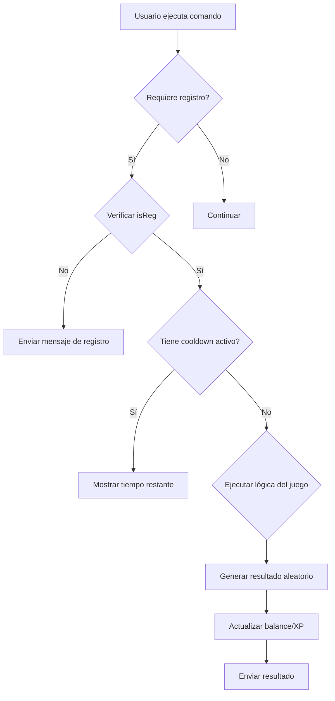
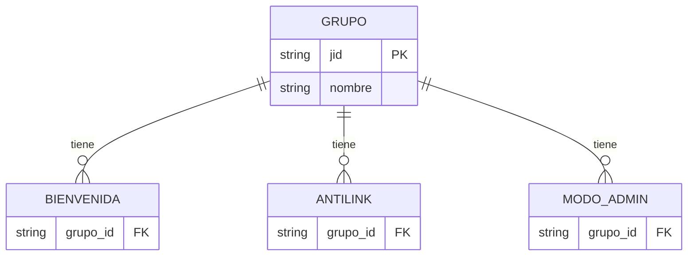

# 📋 SPEC.md - Especificaciones Técnicas de WhatsAppBot

> Especificaciones técnicas detalladas del sistema de WhatsAppBot  
> Fecha de documentación: 2026-04-27  
> Versión: 1.0.0

---

## 1. Visión General del Sistema

### 1.1 Propósito

WhatsAppBot es un bot de WhatsApp basado en la librería Baileys que proporciona funcionalidades de gestión de grupos, juegos RPG, descargas multimedia y herramientas interactivas para comunidades de WhatsApp.

### 1.2 Tecnología Principal

| Componente | Tecnología | Versión |
|-----------|-----------|--------|
| Librería WhatsApp | Baileys | 6.7.21 |
| Runtime | Node.js | 18+ LTS |
| Protocolo | WhatsApp Web Protocol | MD |

---

## 2. Arquitectura del Sistema

### 2.1 Componentes Principales

```
┌─────────────────────────────────────────────────────────────────┐
│                    WhatsAppBot                     │
├─────────────────────────────────────────────────────────────────┤
│                                                         │
│  ┌─────────────┐    ┌─────────────┐    ┌─────────────┐  │
│  │  INDEX.JS │    │  GAMES/    │    │  FUCTION/ │  │
│  │  (Main)  │    │ (RPG/Game)│    │ (Utils)   │  │
│  └─────────────┘    └─────────────┘    └─────────────┘  │
│        │                  │                  │         │
│        ▼                  ▼                  ▼         │
│  ┌─────────────────────────────────────────────┐    │
│  │              SETTINGS/                       │    │
│  │  - Configuración del bot                    │    │
│  │  - Registros de usuarios                    │    │
│  │  - Configuraciones de grupos                │    │
│  └─────────────────────────────────────────────┘    │
│                                                         │
│  ┌─────────────────────────────────────────────┐    │
│  │              EXTERNAL APIs                  │    │
│  │  - api.naufrabot.com                      │    │
│  │  - Descargas (YouTube, TikTok, FB, etc.)    │    │
│  │  - AI/ChatGPT                            │    │
│  └─────────────────────────────────────────────┘    │
│                                                         │
└─────────────────────────────────────────────────────────────────┘
```

### 2.2 Flujo de Mensajes



---

## 3. Sistema de Registro y Economía

### 3.1 Estructura de Usuario

Cada usuario registrado tiene la siguiente estructura:

```typescript
interface Usuario {
  id: string;              // JID de WhatsApp ( formato: 519xxxxxxxx@s.whatsapp.net )
  nombre: string;          // Nombre guardado desde pushName
  nivel: number;          // Nivel actual (1-100)
  xp: number;            // Experiencia acumulada
  rxp: number;          // Experiencia requerida para siguiente nivel
  dinero: number;        // Coins/Rupias disponibles
  rep: number;           // Puntos de reputacion
}
```

### 3.2 Sistema de Niveles

| Nivel | Rango | XP Requerida Acumulada |
|-------|------|-------------------|
| 1-5 | 🥊 Novato I-V | 0-5000 |
| 6-10 | 🥉 Bronce I-V | 5000-11000 |
| 11-15 | 🥈 Plata I-V | 11000-21000 |
| 16-20 | 🥇 Oro I-V | 21000-35000 |
| 21-25 | 🦾 Platino I-V | 35000-55000 |
| 26-30 | 💎 Diamante I-V | 55000-80000 |
| 31-35 | 🥋 Maestro I-V | 80000-110000 |
| 36-40 | ⛩ Gran Maestro I-V | 110000-145000 |
| 41-45 | 🐉 Legendario I-V | 145000-185000 |
| 100 | 🥒 Follador Legendario | 1000000+ |

### 3.3 Funciones de Economía

| Función | Descripción | Archivo |
|--------|------------|---------|
| `MoneyOfSender(jid)` | Obtener saldo del usuario | reg.js:73 |
| `addkoin(jid, monto)` | Agregar coins | reg.js:60 |
| `delkoin(jid, monto)` | Descontar coins | reg.js:47 |
| `addXp(jid, monto)` | Agregar experiencia | reg.js:138 |
| `levelOfsender(jid)` | Obtener nivel | reg.js:151 |
| `xpOfsender(jid)` | Obtener XP actual | reg.js:163 |
| `addLevel(jid, monto)` | Agregar niveles | reg.js:125 |
| `addRep(jid, monto)` | Agregar reputacion | reg.js:204 |
| `repUser(jid)` | Obtener reputacion | reg.js:270 |

---

## 4. Sistema de Juegos

### 4.1 Juegos Disponibles

| Juego | Comando | Cooldown | Recompensa |
|-------|---------|----------|------------|
| Minería | `.minar` | 24 horas | ₹5-10 |
| Diario | `.daily` | 24 horas | ₹1 + 5 XP |
| Ruleta Rusa | `.ruleta <apuesta>` | 24 horas |₹1-5 (50% probabilidad) |
| Tragamedas | `.tragamonedas` | 8 horas | ₹5-10 o 5-10 XP |
| Pesca | `.pescar` | 8 horas | ₹1-20 + XP |
| Emoji Mix | `.emojimix 😊+😂` | - | 1 coin |

### 4.2 Lógica de Juegos



---

## 5. Sistema de Gestión de Grupos

### 5.1 Funcionalidades de Grupo

| Función | Comando | Permiso | Archivo |
|--------|---------|--------|---------|
| Bienvenida | `.welcome 1/0` | Admin | index.js:1001 |
| AntiLink | `.antilink 1/0` | Admin | index.js:1173 |
| Modo Admin | `.modoadmin 1/0` | Admin | index.js:1092 |
| AntiPrivado | `.antipv on/off` | Owner | index.js:692 |
| Kick/Ban | `.kick @user` | Admin | index.js:1153 |
| Abrir/Cerrar Grupo | `.grupo abrir/cerrar` | Admin | index.js:1197 |
| Hidetag | `.notify texto` | Admin | index.js:1131 |
| Lista de miembros | `.todos` | Usuario | index.js:1053 |

### 5.2 Estructura de Configuración de Grupos



---

## 6. Sistema de Comandos

### 6.1 Prefijos Soportados

```javascript
const prefixo = ['#','/','•','.','!','?','*']
```

### 6.2 Permisos de Comandos

| Tipo | Descripción | Requiere |
|------|------------|----------|
| Owner | Solo owner del bot | `isOwner = true` |
| Admin | Admin del grupo | `isGroupAdmins = true` |
| Registro | Usuario registrado | `isReg = true` |
| Grupo | Solo en grupos | `isGroup = true` |
| Público | Cualquier usuario | - |

### 6.3 Flags de Mensajes

El bot detecta diferentes tipos de mensajes:

```typescript
type MessageType = 
  | 'conversation'       // Texto simple
  | 'imageMessage'       // Imagen con caption
  | 'videoMessage'       // Video con caption
  | 'audioMessage'       // Audio/Voice note
  | 'stickerMessage'    // Sticker
  | 'documentMessage'    // Documento
  | 'locationMessage'    // Ubicación
  | 'contactMessage'     // Contacto
```

---

## 7. Integraciones Externas

### 7.1 API Externa: api.naufrabot.com

| Endpoint | Descripción | Requiere API Key |
|----------|------------|------------------|
| `/ytmp3` | Descargar audio YouTube | Sí |
| `/ytmp4` | Descargar video YouTube | Sí |
| `/ytinfo` | Info de video YouTube | Sí |
| `/ytsearch` | Buscar en YouTube | Sí |
| `/fbvideo` | Descargar video Facebook | Sí |
| `/tiktok` | Descargar video TikTok | Sí |
| `/instagram` | Descargar de Instagram | Sí |
| `/mediafire-dl` | Descargar de MediaFire | Sí |
| `/chatgpt` | Consulta a IA | Sí |
| `/attp` | Sticker con texto | Sí |
| `/canvas/ship` | Imagen de amor | Sí |

### 7.2 API Key Configuration

La API key se configura en `settings/settings.json`:

```json
{
  "NAUFRA_KEY": "keygratis11"
}
```

---

## 8. Configuración del Bot

### 8.1 Variables de Configuración

| Variable | Archivo | Descripción |
|----------|--------|-------------|
| `owner` | settings.json | JID del owner del bot |
| `Bot` | settings.json | Nombre del bot |
| `JpgBot` | settings.json | URL de la imagen del menú |
| `creador` | settings.json | Nombre del creador |
| `NAUFRA_KEY` | settings.json | Clave API |

### 8.2 Estado del Bot

| Variable | Archivo | Default |
|----------|---------|---------|
| `activo` | settings/estadoBot.json | `true` |

---

## 9. Logging y Monitoreo

### 9.1 Logs en Consola

El bot muestra logs estructurados para:

- Comandos ejecutados (PV y Grupos)
- Mensajes recibidos
- Conexiones/Desconecciones
- Errores

### 9.2 Formato de Log

```
╔─━━━━  IMD 「 USUARIO 」━━━━╗
 GRUPO : nombre-del-grupo
 NOMBRE : nombre-del-usuario
 COMANDO : comando-ejecutado
 HORA : HH:mm:ss
 DATOS : DD/MM/AA
╚─━━━━━━━━━━ ELISVAN ━━━━━━━━━━╝
```

---

## 10. Limitaciones y bugs Conocidos

### 10.1 Issues Técnicos

1. **Archivo monolítico**: `index.js` tiene más de 2700 líneas, violando el principio de responsabilidad única
2. **Credenciales hardcodeadas**: Número de teléfono y API key en código fuente
3. **Sin tests**: No existe suite de tests automatizados
4. **Persistencia simple**: JSON en texto plano sin cifrado
5. **APIs externas**: Dependencia de api.naufrabot.com (puede estar no disponible)
6. **Manejo de errores**:try/catch genéricos que no specifics mensajes de error

### 10.2 Mejoras Sugeridas

1. Separar comandos en módulos independientes
2. Implementar base de datos (SQLite/PostgreSQL)
3. Agregar sistema de logs estructurado
4. Implementar caché para reducir latencia
5. Agregar Tests unitarios y de integración
6. Variables de entorno para configuración sensible

---

## 11. Anexo: Glosario

| Término | Definición |
|---------|-----------|
| JID | WhatsApp ID - Identificador único de usuario/grupo |
| Baileys | Librería para conectar con WhatsApp Web |
| XP | Experiencia - puntos para subir de nivel |
| Coins/Rupias | Moneda virtual del juego |
| Rep | Reputación - puntos de reputación |
| Cooldown | Tiempo de espera entre ejecuciones |
| ATTP | Sticker con texto (Animated Text To Picture) |

---

*Documentación generada para WhatsAppBot - 2026*