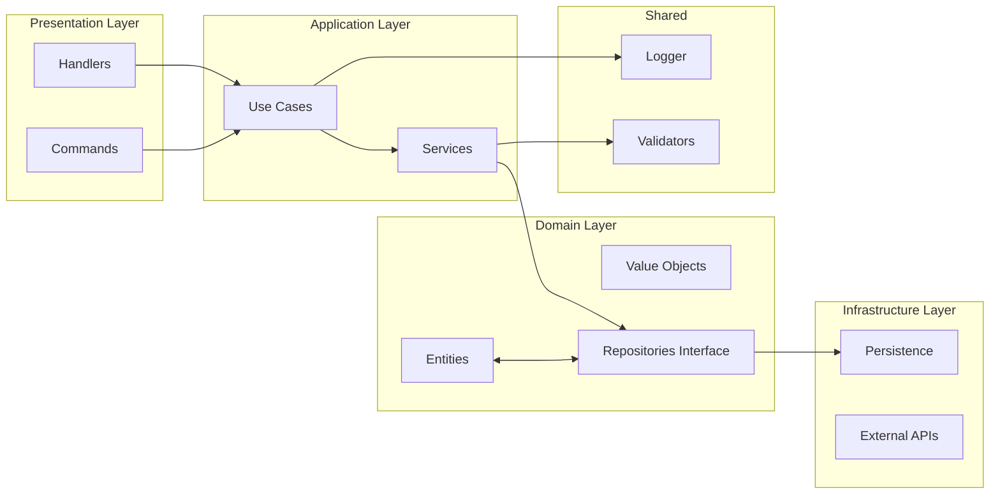
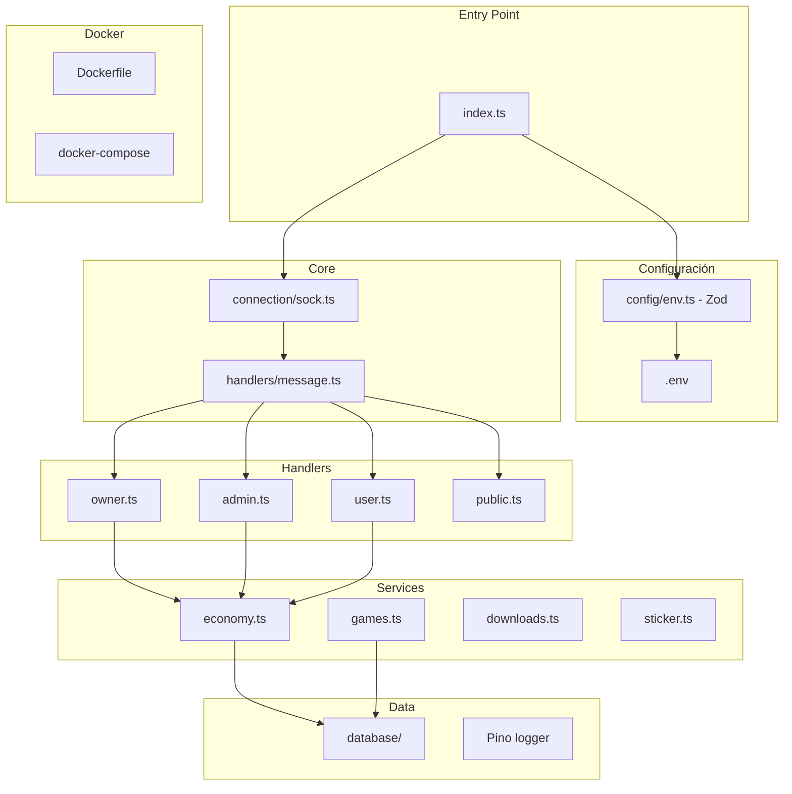
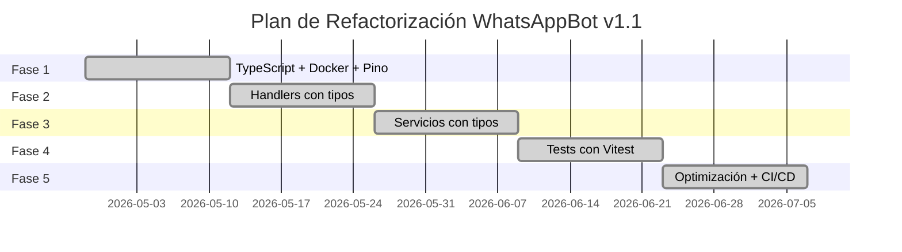

# PROPOSAL-001: Plan de Refactorización de WhatsAppBot (Scream + Clean Architecture)

> Plan de refactorización completo con arquitectura escalable  
> Fecha: 2026-04-27  
> Versión: 1.2.0  
> Estado: Aprobado con puntualizaciones + nueva arquitectura  
> Autor: dvyd

---

## 1. Resumen Ejecutivo

### 1.1 Problema

El código actual de WhatsAppBot presenta issues críticos que dificultan el mantenimiento y evolución:

| Issue | Impacto | Prioridad |
|-------|--------|----------|
| index.js con 2700+ líneas | Difícil mantener | Alta |
| Credenciales hardcodeadas | Security risk | Alta |
| Sin tests | Código frágil | Alta |
| Sin módulos | Violación SRP | Alta |
| JavaScript sin tipos | Errores en runtime | Alta |
| Persistencia naive | Datos inseguros | Media |

### 1.2 Objetivo

Transformar WhatsAppBot en un proyecto mantenible, testeable, tipado y escalable mediante refactorización gradual.

### 1.3 Scope

**Incluido**:
- TypeScript obligatorio
- Módulos separados
- Tests con Vitest
- Logging con Pino
- Validación con Zod
- Environment variables
- Docker (Dockerfile + docker-compose)
- Documentación actualizada

**Excluido**:
- Cambio de tecnología (Baileys → otra)
- Reescritura completa
- Dashboard web
- API REST

**Excluido por puntualización del owner**:
- Jest (se usa Vitest)
- npm (se usa pnpm)

---

## 2. Estado Actual del Código

### 2.1 Estructura Actual

```
whatsapp-bot/
├── index.js                    # 2700+ líneas (monolítico, JS)
├── package.json
├── start.sh
├── settings/                   # Configuración hardcoded
│   ├── settings.json
│   ├── estadoBot.json
│   ├── rangos.json
│   ├── Bot/Js/menu.js
│   ├── Grupo/
│   │   ├── Js/reg.js          # 299 líneas
│   │   └── Json/*.json
│   └── User/Js/ind.js
├── fuction/                   # Utilidades
│   ├── download/gets.js
│   ├── settings/fuctions.js   # 260 líneas
│   └── sticker/*.js
├── Games/                      # Juegos
│   ├── Js/
│   │   ├── claim.js
│   │   └── mining.js          # 1000+ líneas
│   └── Json/*.json
└── session/                    # Credenciales
```

### 2.2 Métricas

| Métrica | Valor Actual | Valor Objetivo |
|---------|-------------|---------------|
| Líneas de index.js | 2728 | <300 por módulo |
| Tests | 0 | >80% coverage |
| Módulos | 1 | 15+ módulos |
| TypeScript | 0% | 100% |
| ES Modules | 0% | 100% (type: module) |
| Dependencies en .env | 0 | loadEnvFile nativo |
| Docker | No | Sí |
| Gestor de paquetes | npm | pnpm |
| HTTP client | axios | fetch nativo |
| Env variables | dotenv | Node loadEnvFile |
| Require | 100% | 0% (usar import) |

---

## 3. Stack Tecnológico

### 3.1 Dependencias Principales

| Librería | Propósito | Gestor |
|----------|-----------|--------|
| `baileys` | WhatsApp Web | pnpm |
| `pino` | Logging estructurado | pnpm |
| `zod` | Validación de esquemas | pnpm |
| `tsx` | Ejecutar TypeScript | pnpm |
| `node` | LTS (Node.js 20+) | sistema |

### 3.2 Notas sobre decisiones

- **dotenv**: No necesario - Node.js tiene `loadEnvFile()` nativo desde v20.11
- **axios**: No necesario - Node.js tiene `fetch` nativo desde v18
- **Node LTS**: Usar versión LTS más reciente (20.x aktual al momento)

### 3.3 Arquitectura: Scream + Clean Architecture

```
src/
├── main/                          # Entry point
│   └── index.ts                  # Composition root
│
├── domain/                       # Domain Layer (innermost)
│   ├── entities/                # Entidades del negocio
│   │   ├── User.ts
│   │   ├── Game.ts
│   │   └── Group.ts
│   ├── repositories/             # Interfaces de repositorio
│   │   ├── IUserRepository.ts
│   │   ├── IGameRepository.ts
│   │   └── IGroupRepository.ts
│   └── value-objects/             # Value objects
│       ├── JID.ts
│       └── Money.ts
│
├── application/                   # Application Layer
│   ├── use-cases/               # Casos de uso
│   │   ├── user/
│   │   │   ├── RegisterUser.ts
│   │   │   └── AddCoins.ts
│   │   ├── game/
│   │   │   ├── PlayMining.ts
│   │   │   └── PlayRoulette.ts
│   │   ├── economy/
│   │   │   └── TransferCoins.ts
│   │   └── downloads/
│   │       └── DownloadYouTube.ts
│   └── services/                # Servicios de aplicación
│       ├── CommandService.ts
│       └── MessageHandlerService.ts
│
├── infrastructure/               # Infrastructure Layer
│   ├── persistence/
│   │   ├── JsonUserRepository.ts
│   │   ├── JsonGameRepository.ts
│   │   └── JsonGroupRepository.ts
│   ├── external/
│   │   ├── BaileysConnection.ts
│   │   ├── NaufrabotAPI.ts
│   │   └── WhatsAppAPI.ts
│   └── logging/
│       └── PinoLogger.ts
│
├── presentation/                  # Presentation Layer
│   ├── handlers/
│   │   ├── message.handler.ts
│   │   └── group.handler.ts
│   └── commands/
│       ├── owner/
│       ├── admin/
│       ├── user/
│       └── public/
│
├── plugins/                       # Plugin System
│   ├── core/                    # Features core (always loaded)
│   │   ├── economy/
│   │   ├── games/
│   │   ├── downloads/
│   │   └── sticker/
│   └── external/                 # Plugins externos (load on demand)
│       ├── ai-chat/
│       ├── music-player/
│       └── custom-commands/
│
├── shared/                       # Código compartido
│   ├── utils/
│   │   ├── logger.ts
│   │   ├── validators.ts
│   │   └── cache.ts
│   ├── types/
│   │   ├── common.ts
│   │   └── config.ts
│   ├── errors/
│   │   ├── AppError.ts
│   │   └── NotFoundError.ts
│   └── constants/
│       └── index.ts
│
└── config/                       # Configuración
    ├── env.ts                   # Zod schemas para configuración
    └── defaults.ts
```

### 3.4 Sistema de Plugins

```typescript
// Plugin Interface
interface WhatsAppBotPlugin {
  name: string;
  version: string;
  dependencies?: string[];
  
  // Hooks del ciclo de vida
  onLoad?(container: Container): Promise<void>;
  onUnload?(): Promise<void>;
  
  // Registro de comandos
  registerCommands(registry: CommandRegistry): void;
  
  // Handlers de eventos
  onMessage?(context: MessageContext): Promise<void>;
}

// Ejemplo: Plugin económico
const economyPlugin: WhatsAppBotPlugin = {
  name: 'economy',
  version: '1.0.0',
  
  registerCommands(registry) {
    registry.register('.minar', MiningHandler);
    registry.register('.daily', DailyHandler);
  },
  
  onMessage(context) {
    // Logic when message arrives
  }
};
```

### 3.5 Capas y Flujo de Datos



### 3.6 Principios de Arquitectura

| Principio | Aplicación |
|----------|------------|
| **Dependency Inversion** | Domain no conoce Infrastructure |
| **Single Responsibility** | Cada clase una responsabilidad |
| **Plugin Isolation** | Plugins no se conocen entre sí |
| **Shared Common** | Código reutilizable en src/shared |
| **Feature Independence** | Cada feature en su propio módulo |

---

## 4. Propuesta de Nueva Arquitectura

### 4.1 Estructura Objetivo

```
whatsapp-bot/
├── src/
│   ├── index.ts               # Entry point (limpio)
│   ├── config/
│   │   ├── index.ts           # Carga de configuración
│   │   ├── env.ts             # Environment variables (Zod)
│   │   └── defaults.ts        # Valores por defecto
│   ├── connection/
│   │   ├── sock.ts           # Conexión Baileys
│   │   ├── auth.ts          # Autenticación
│   │   └── reconnect.ts     # Reconexión
│   ├── handlers/
│   │   ├── message.ts       # Handler principal
│   │   ├── group.ts          # Eventos de grupo
│   │   └── commands/
│   │       ├── index.ts
│   │       ├── owner.ts
│   │       ├── admin.ts
│   │       ├── user.ts
│   │       └── public.ts
│   ├── services/
│   │   ├── economy.ts        # Sistema económico
│   │   ├── games.ts         # Juegos
│   │   ├── downloads.ts     # Descargas
│   │   ├── sticker.ts      # Sticker/media
│   │   └── ai.ts          # Integración IA
│   ├── utils/
│   │   ├── logger.ts       # Pino logger
│   │   ├── validators.ts   # Zod schemas
│   │   ├── cache.ts       # Cache
│   │   └── helpers.ts    # Helpers
│   ├── types/
│   │   └── index.ts       # TypeScript types
│   └── database/
│       ├── index.ts       # Interface
│       └── json.ts        # Implementación JSON
├── tests/
│   ├── unit/
│   └── integration/
├── scripts/
│   └── start.sh
├── docker/
│   ├── Dockerfile
│   └── docker-compose.yml
├── docs/
├── .env.example
├── package.json
├── tsconfig.json
├── vitest.config.ts
└── README.md
```

### 4.2 Tipado con Zod

```typescript
// Ejemplo de validación de configuración con Zod
import { z } from 'zod';

const ConfigSchema = z.object({
  OWNER_JID: z.string(),
  NAUFRA_KEY: z.string(),
  BOT_NAME: z.string().default('WhatsAppBot'),
  PREFIX: z.array(z.string()).default(['#', '/']),
  TIMEZONE: z.string().default('Europe/Madrid'),
  API_URL: z.string().url(),
});

type Config = z.infer<typeof ConfigSchema>;
```

### 4.3 Logging con Pino

```typescript
// Ejemplo de logger estructurado
import pino from 'pino';

const logger = pino({
  level: process.env.LOG_LEVEL || 'info',
  transport: {
    target: 'pino-pretty',
    options: { colorize: true }
  }
});

logger.info({ command: '.menu', user: sender }, 'Comando ejecutado');
```

### 4.4 Docker

```yaml
# docker-compose.yml
version: '3.8'
services:
  whatsappbot:
    build:
      context: .
      dockerfile: docker/Dockerfile
    env_file:
      - .env
    volumes:
      - ./session:/app/session
      - ./data:/app/data
    restart: unless-stopped
```

```dockerfile
# docker/Dockerfile
FROM node:20-alpine

WORKDIR /app

# Instalar pnpm
RUN npm install -g pnpm

# Copiar archivos
COPY package.json pnpm-lock.yaml ./
RUN pnpm install --frozen-lockfile

COPY . .

# Compilar TypeScript
RUN pnpm build

# Ejecutar
CMD ["pnpm", "start"]
```

### 4.5 Diagrama de Arquitectura



---

## 5. Fases de Implementación

### Fase 1: Fundamentos (Semana 1-2)

**Objetivo**: Preparar estructura base con TypeScript y Docker

| # | Tarea | Archivos | Estado |
|---|-------|---------|--------|
| 1.1 | Inicializar TypeScript | `tsconfig.json` | ⬜ |
| 1.2 | Configurar pnpm | `package.json` | ⬜ |
| 1.3 | Crear estructura `src/` | - | ⬜ |
| 1.4 | Crear config con Zod | `src/config/` | ⬜ |
| 1.5 | Configurar Pino logger | `src/utils/logger.ts` | ⬜ |
| 1.6 | Crear Dockerfile | `docker/Dockerfile` | ⬜ |
| 1.7 | Crear docker-compose | `docker-compose.yml` | ⬜ |
| 1.8 | Migrar index.js a index.ts | `src/index.ts` | ⬜ |

**Entregable**: Proyecto corre con TypeScript y Docker

### Fase 2: Handlers (Semana 3-4)

**Objetivo**: Separar handlers de mensajes con tipos

| # | Tarea | Archivos | Estado |
|---|-------|---------|--------|
| 2.1 | Crear message handler | `src/handlers/message.ts` | ⬜ |
| 2.2 | Separar comandos | `src/handlers/commands/` | ⬜ |
| 2.3 | Crear command router | `src/handlers/commands/index.ts` | ⬜ |
| 2.4 | Migrar comandos owner | `src/handlers/commands/owner.ts` | ⬜ |
| 2.5 | Migrar comandos admin | `src/handlers/commands/admin.ts` | ⬜ |
| 2.6 | Migrar comandos user | `src/handlers/commands/user.ts` | ⬜ |
| 2.7 | Migrar comandos public | `src/handlers/commands/public.ts` | ⬜ |

**Entregable**: src/index.ts <500 líneas

### Fase 3: Servicios (Semana 5-6)

**Objetivo**: Extraer lógica de negocio con tipos

| # | Tarea | Archivos | Estado |
|---|-------|---------|--------|
| 3.1 | Crear servicio economy | `src/services/economy.ts` | ⬜ |
| 3.2 | Crear servicio games | `src/services/games.ts` | ⬜ |
| 3.3 | Crear servicio downloads | `src/services/downloads.ts` | ⬜ |
| 3.4 | Crear servicio sticker | `src/services/sticker.ts` | ⬜ |
| 3.5 | Refactorizar reg.ts | `src/services/registry.ts` | ⬜ |

**Entregable**: Lógica de negocio separada

### Fase 4: Tests con Vitest (Semana 7-8)

**Objetivo**: Asegurar calidad con tests

| # | Tarea | Archivos | Estado |
|---|-------|---------|--------|
| 4.1 | Configurar Vitest | `vitest.config.ts` | ⬜ |
| 4.2 | Test economy service | `tests/unit/economy.test.ts` | ⬜ |
| 4.3 | Test games service | `tests/unit/games.test.ts` | ⬜ |
| 4.4 | Test command routing | `tests/unit/commands.test.ts` | ⬜ |
| 4.5 | Test validators | `tests/unit/validators.test.ts` | ⬜ |

**Entregable**: >70% coverage

### Fase 5: Optimización (Semana 9-10)

**Objetivo**: Mejoras de rendimiento y calidad

| # | Tarea | Archivos | Estado |
|---|-------|---------|--------|
| 5.1 | Implementar cache | `src/utils/cache.ts` | ⬜ |
| 5.2 | Optimizar JSON reads | `src/database/` | ⬜ |
| 5.3 | Agregar rate limiting | `src/utils/rateLimit.ts` | ⬜ |
| 5.4 | Health checks | `src/utils/health.ts` | ⬜ |
| 5.5 | CI/CD pipeline | `.github/workflows/` | ⬜ |

**Entregable**: Rendimiento mejorado + CI/CD

---

## 6. Roadmap Visual



---

## 7. Gestión de Riesgos

| Riesgo | Probabilidad | Impacto | Mitigación |
|--------|--------------|---------|------------|
| Romper funcionalidad existente | Alta | Alto | Tests antes de cada fase |
| Dependencias circulares | Media | Medio | Arquitectura clara |
| Tiempo insuficiente | Alta | Alto | Scope controlado |
| Credenciales comprometidaes | Baja | Crítico | Rotación de keys |
| Errores de TypeScript | Media | Medio | strict mode incremental |

---

## 8. Criterios de Éxito

| Criterio | Mínimo | Objetivo |
|---------|--------|---------|
| Líneas en src/index.ts | <500 | <200 |
| Cobertura de tests | 50% | 80% |
| Módulos TypeScript | 10 | 20 |
| Strict mode TS | Sí | Sí |
| Docs actualizadas | 100% | 100% |
| Breaking changes | 0 | 0 |
| Docker funcional | Sí | Sí |

---

## 9. Decisiones de Diseño (v1.1)

| Decisión | Justificación |
|---------|---------------|
| **pnpm** | Gestor moderno, lock preciso, faster |
| **TypeScript obligatorio** | Prevenir errores de tipado en runtime |
| **Pinojs** | Logging estructurado, estándar en producción |
| **Zod** | Validación de esquemas, tipado inferido |
| **Vitest** | Más rápido que Jest, API compatible |
| **Docker** | Despliegue reproducible |
| **Node.js nativo** | No hay axios ni dotenv (usar fetch y loadEnvFile) |
| **JSON como BD temporal** | Simple, no requiere infra |
| **Estructura src/** | Separación clara de código |

---

## 10. Instalación de Dependencias (Flujo pnpm)

```bash
# Inicializar proyecto
pnpm init

# Instalar dependencias principales (solo baileys, pino, zod)
pnpm add baileys pino zod

# Instalar devDependencies
pnpm add -D typescript vitest @types/node tsx pino-pretty

# Instalar globales (opcional)
pnpm add -g tsx
```

### 10.1 Notas Importantes

- **No dotenv**: Usar `import.meta.env` de Node.js (v20.11+)
- **No axios**: Usar `fetch` nativo de Node.js (v18+)
- **Node LTS**:Versión 20.x o superior

---

## 11. Próximos Pasos

1. [ ] Aprobar esta versión de la propuesta
2. [ ] Crear branch `refactor/`
3. [ ] Iniciar Fase 1: Fundamentos
4. [ ] Iterar semanalmente con bitácora

---

## 12. Referencias

- [docs/SPEC.md](../SPEC.md) - Especificaciones actuales
- [docs/specs/](../specs/) - Specs granulares
- [AGENTS.md](../AGENTS.md) - Workflow agentico
- [CODE_OF_CONDUCT.md](../CODE_OF_CONDUCT.md) - Código de conducta

---

*Propuesta aprobada con puntualizaciones - 2026*