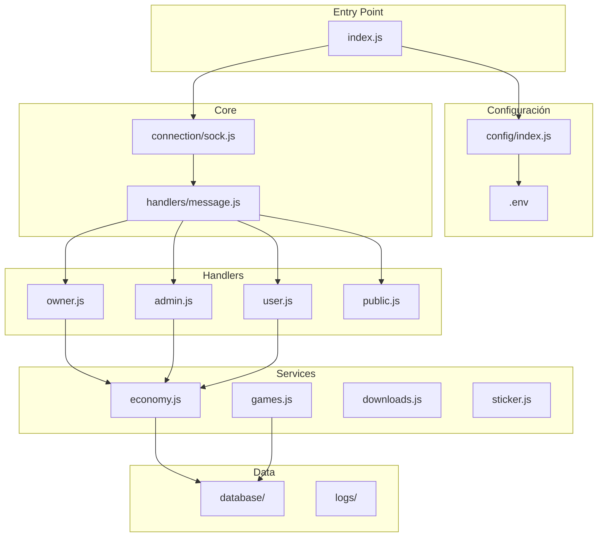
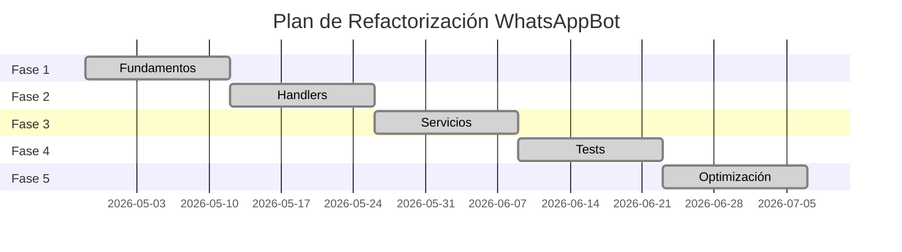

# PROPOSAL-001: Plan de Refactorización de WhatsAppBot

> Plan de refactorización completo para profesionalizar el código  
> Fecha: 2026-04-27  
> Versión: 1.0.0  
> Estado: En revisión  
> Autor: dvyd

---

## 1. Resumen Ejecutivo

### 1.1 Problema

El código actual de WhatsAppBot presenta issues críticos que dificultan el mantenimiento y evolución:

| Issue | Impacto | Prioridad |
|-------|--------|----------|
| index.js con 2700+ líneas | Difícil mantener | Alta |
| Credenciales hardcodeadas | Security risk | Alta |
| Sin tests | Código frágil | Alta |
| Sin módulos | Violación SRP | Alta |
| Persistencia naive | Datos inseguros | Media |

### 1.2 Objetivo

Transformar WhatsAppBot en un proyecto mantenible, testeable y escalable mediante refactorización gradual.

### 1.3 Scope

**Incluido**:
- Separación en módulos
- Tests unitarios
- Environment variables
- Mejor logging
- Documentación actualizada

**Excluido**:
- Cambio de tecnología (Baileys → otra)
- Reescritura completa
- Dashboard web
- API REST

---

## 2. Estado Actual del Código

### 2.1 Estructura Actual

```
whatsapp-bot/
├── index.js                    # 2700+ líneas (monolítico)
├── package.json
├── start.sh
├── settings/                   # Configuración hardcoded
│   ├── settings.json
│   ├── estadoBot.json
│   ├── rangos.json
│   ├── Bot/Js/menu.js
│   ├── Grupo/
│   │   ├── Js/reg.js          # 299 líneas
│   │   └── Json/*.json
│   └── User/Js/ind.js
├── fuction/                   # Utilidades
│   ├── download/gets.js
│   ├── settings/fuctions.js   # 260 líneas
│   └── sticker/*.js
├── Games/                      # Juegos
│   ├── Js/
│   │   ├── claim.js
│   │   └── mining.js          # 1000+ líneas
│   └── Json/*.json
└── session/                    # Credenciales
```

### 2.2 Métricas

| M��trica | Valor Actual | Valor Objetivo |
|---------|-------------|---------------|
| Líneas de index.js | 2728 | <300 por módulo |
| Tests | 0 | >80% coverage |
| Módulos | 1 | 15+ módulos |
| Dependencies declaradas | 0 | Todas en .env |
| Archivos docs | 14 | Actualizados |

---

## 3. Propuesta de Nueva Arquitectura

### 3.1 Estructura Objetivo

```
whatsapp-bot/
├── src/
│   ├── index.js               # Entry point (limpio)
│   ├── config/
│   │   ├── index.js          # Carga de configuración
│   │   ├── env.js            # Environment variables
│   │   └── defaults.js       # Valores por defecto
│   ├── connection/
│   │   ├── sock.js          # Conexión Baileys
│   │   ├── auth.js          # Autenticación
│   │   └── reconnect.js     # Reconexión
│   ├── handlers/
│   │   ├── message.js       # Handler principal
│   │   ├── group.js         # Eventos de grupo
│   │   └── commands/        # Comandos
│   │       ├── index.js
│   │       ├── owner.js
│   │       ├── admin.js
│   │       ├── user.js
│   │       └── public.js
│   ├── services/
│   │   ├── economy.js       # Sistema económico
│   │   ├── games.js         # Juegos
│   │   ├── downloads.js     # Descargas
│   │   ├── sticker.js       # Sticker/media
│   │   └── ai.js           # Integración IA
│   ├── utils/
│   │   ├── logger.js        # Logging estructurado
│   │   ├── validators.js   # Validaciones
│   │   └── helpers.js      # Helpers
│   └── database/
│       ├── index.js         # Interface
│       └── json.js         # Implementación JSON
├── tests/
│   ├── unit/
│   └── integration/
├── scripts/
│   └── start.sh
├── docs/                     # Documentación
├── .env.example             # Template env
├── package.json
└── README.md
```

### 3.2 Diagrama de Arquitectura



---

## 4. Fases de Implementación

### Fase 1: Fundamentos (Semana 1-2)

**Objetivo**: Preparar estructura base sin cambiar funcionalidad

| # | Tarea | Archivos | Estado |
|---|-------|---------|--------|
| 1.1 | Crear estructura de carpetas `src/` | - | ⬜ |
| 1.2 | Crear config loader | `src/config/` | ⬜ |
| 1.3 | Migrar settings a env | `.env`, `src/config/` | ⬜ |
| 1.4 | Crear logger básico | `src/utils/logger.js` | ⬜ |
| 1.5 | Separar connection en módulo | `src/connection/` | ⬜ |
| 1.6 | Actualizar package.json scripts | `package.json` | ⬜ |

**Entregable**: Proyecto corre con nueva estructura

### Fase 2: Handlers (Semana 3-4)

**Objetivo**: Separar handlers de mensajes

| # | Tarea | Archivos | Estado |
|---|-------|---------|--------|
| 2.1 | Crear message handler | `src/handlers/message.js` | ⬜ |
| 2.2 | Separar comandos | `src/handlers/commands/` | ⬜ |
| 2.3 | Crear command router | `src/handlers/commands/index.js` | ⬜ |
| 2.4 | Migrar comandos owner | `src/handlers/commands/owner.js` | ⬜ |
| 2.5 | Migrar comandos admin | `src/handlers/commands/admin.js` | ⬜ |
| 2.6 | Migrar comandos user | `src/handlers/commands/user.js` | ⬜ |
| 2.7 | Migrar comandos public | `src/handlers/commands/public.js` | ⬜ |

**Entregable**: index.js <500 líneas

### Fase 3: Servicios (Semana 5-6)

**Objetivo**: Extraer lógica de negocio

| # | Tarea | Archivos | Estado |
|---|-------|---------|--------|
| 3.1 | Crear servicio economy | `src/services/economy.js` | ⬜ |
| 3.2 | Crear servicio games | `src/services/games.js` | ⬜ |
| 3.3 | Crear servicio downloads | `src/services/downloads.js` | ⬜ |
| 3.4 | Crear servicio sticker | `src/services/sticker.js` | ⬜ |
| 3.5 | Refactorizar reg.js | `src/services/registry.js` | ⬜ |

**Entregable**: Lógica de negocio separada

### Fase 4: Tests (Semana 7-8)

**Objetivo**: Asegurar calidad con tests

| # | Tarea | Archivos | Estado |
|---|-------|---------|--------|
| 4.1 | Configurar Jest | `jest.config.js` | ⬜ |
| 4.2 | Test economy service | `tests/unit/economy.test.js` | ⬜ |
| 4.3 | Test games service | `tests/unit/games.test.js` | ⬜ |
| 4.4 | Test command routing | `tests/unit/commands.test.js` | ⬜ |
| 4.5 | Test validators | `tests/unit/validators.test.js` | ⬜ |

**Entregable**: >70% coverage

### Fase 5: Optimización (Semana 9-10)

**Objetivo**: Mejoras de rendimiento y calidad

| # | Tarea | Archivos | Estado |
|---|-------|---------|--------|
| 5.1 | Implementar cache | `src/utils/cache.js` | ⬜ |
| 5.2 | Optimizar JSON reads | `src/database/` | ⬜ |
| 5.3 | Agregar rate limiting | `src/utils/rateLimit.js` | ⬜ |
| 5.4 | Mejorar logging | `src/utils/logger.js` | ⬜ |
| 5.5 | Agregar health checks | `src/utils/health.js` | ⬜ |

**Entregable**: Rendimiento mejorado

---

## 5. Roadmap Visual



---

## 6. Gestión de Riesgos

| Riesgo | Probabilidad | Impacto | Mitigación |
|--------|--------------|---------|------------|
| Romper funcionalidad existente | Alta | Alto | Tests antes de cada fase |
| Dependencias circulares | Media | Medio | Arquitectura clara |
| Tiempo insuficiente | Alta | Alto | Scope controlado |
| Credenciales comprometidas | Baja | Crítico | Rotación de keys |

---

## 7. Criterios de Éxito

| Criterio | Mínimo | Objetivo |
|---------|--------|---------|
| Líneas en index.js | <500 | <200 |
| Cobertura de tests | 50% | 80% |
| Módulos creados | 10 | 20 |
| Docs actualizadas | 100% | 100% |
| Breaking changes | 0 | 0 |

---

## 8. Decisiones de Diseño

| Decisión | Justificación |
|---------|---------------|
| Mantener Baileys | Stable, conocido, funciona |
| JSON como BD temporal | Simple, no requiere infra |
| Estructura src/ | Separación clara de código |
| Environment variables | Seguridad, configurabilidad |
| Jest para tests | Simple, estándar Node |

---

## 9. Próximos Pasos

1. [ ] Revisar y aprobar esta propuesta
2. [ ] Crear branch `refactor/`
3. [ ] Iniciar Fase 1: Fundamentos
4. [ ] Iterar semanalmente con bitácora

---

## 10. Referencias

- [docs/SPEC.md](../SPEC.md) - Especificaciones actuales
- [docs/specs/](../specs/) - Specs granulares
- [AGENTS.md](../AGENTS.md) - Workflow agentico

---

*Propuesta generada para revisión - 2026*