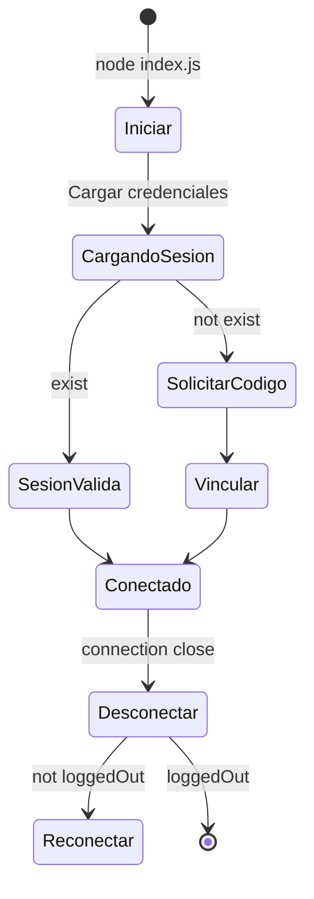

# SPEC: Sistema de Conexión y Autenticación

> **Versión**: 1.0.0  
> **Última actualización**: 2026-04-27  
> **Estado**: ✅ Completado

---

## 1. Descripción General

| Atributo | Valor |
|---------|-------|
| Módulo | Autenticación |
| Archivo principal | `index.js` (líneas 115-180) |
| Dependencias | `@whiskeysockets/baileys`, `useMultiFileAuthState` |

---

## 2. Funcionalidades

### 2.1 Inicio del Bot

```javascript
// index.js:115-180
async function startProo() {
  // 1. Limpiar consola y mostrar banner
  // 2. Cargar credenciales de sesión
  // 3. Obtener versión de Baileys
  // 4. Crear WebSocket
  // 5. Verificar sesión registrada
}
```

### 2.2 Vinculación por Pairing Code

```
CUANDO no hay sesión registrada:
  1. Solicitar número con código de país
  2. Solicitar código de vinculación
  3. Mostrar código de 8 dígitos
```

| Input | Formato | Ejemplo |
|-------|--------|---------|
| Número de teléfono | Dígitos con código de país | `519999999999` |

| Output | Descripción |
|--------|-------------|
| Código de vinculación | 8 dígitos alfanuméricos |

### 2.3 Reconexión Automática

```
CUANDO connection === "close":
  - loggedOut → Mostrar mensaje de sesión cerrada
  - otro → startProo() recursivamente

CUANDO connection === "open":
  - Mostrar "Conectado exitosamente"
```

| Código de Desconexión | Causa |
|----------------------|-------|
| `401` | Sesión invalidada en servidor |
| `408` | Timeout de conexión |

### 2.4 Guardado de Credenciales

- Evento: `creds.update`
- Destino: `./session/`
- Formato: JSON firmadas

---

## 3. Configuración

### 3.1 Parámetros de Sesión

| Variable | Archivo | Descripción |
|----------|---------|-------------|
| `session/` | Carpet a raíz | Directorio de credenciales |

### 3.2 Opciones de Baileys

```javascript
const sock = makeWASocket({
  version: 6.7.21,
  printQRInTerminal: false,  // Cambiar a true para debug
  browser: ["Ubuntu", "Chrome", "20.0.04"],
  auth: { creds, keys },
  markOnlineOnConnect: true,
  syncFullHistory: false
})
```

---

## 4. Estados del Sistema

| Estado | Descripción |
|--------|-------------|
| `connecting` | Conectando a WhatsApp Web |
| `open` | Conectado y activo |
| `close` | Desconectado |
| `connecting + pairing` | Esperando código de vinculación |

---

## 5. Errores Comunes

| Error | Causa | Solución |
|-------|-------|---------|
| QR no aparece | `printQRInTerminal: false` | Cambiar a `true` |
| Sesión cerrada | `DisconnectReason.loggedOut` | Regenerar sesión |
| Timeout | Conexión lenta | Verificar red |

---

## 6. Diagramas



---

## 7. Referencias

- [Baileys Documentation](https://whiskeysockets.github.io/baileys)
- Módulo: `index.js:115-180`

---

*Documento generado automáticamente - 2026*