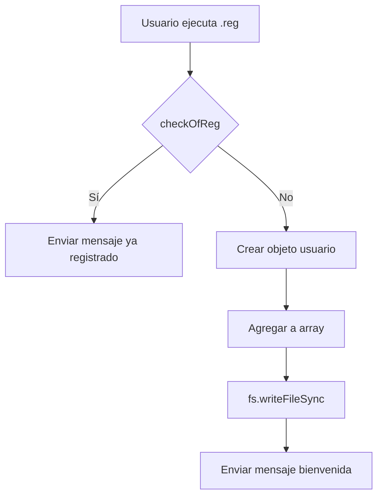

# SPEC: Sistema de Registro de Usuarios

> **Versión**: 1.0.0  
> **Última actualización**: 2026-04-27  
> **Estado**: ✅ Completado

---

## 1. Descripción General

| Atributo | Valor |
|---------|-------|
| Módulo | Registro |
| Archivo principal | `settings/Grupo/Js/reg.js` |
| Archivo de datos | `settings/Grupo/Json/registros.json` |
| Comando触发 | `.reg`, `.registrarme`, `.rg` |

---

## 2. Funcionalidades

### 2.1 Registro de Usuario (.reg)

**Comando**: `case 'reg'` (index.js:1683)

```
FLUJO:
  1. Verificar si ya está registrado (checkOfReg)
  2. SI registrado → "Ya estás registrado" → FIN
  3. Crear objeto con valores por defecto
  4.Agregar a registro
  5. Guardar JSON
  6. Enviar mensaje de bienvenida + 50 Rupias
```

| Precondiciones | Ninguna |
|---------------|---------|

| Datos iniciales | Valor |
|----------------|-------|
| `id` | sender JID |
| `nombre` | pushname |
| `nivel` | 1 |
| `xp` | 1 |
| `rxp` | 0 |
| `dinero` | 50 |
| `rep` | 0 |

| Postcondiciones | Usuario agregado a `registros.json` |
|----------------|------------------------------------|

### 2.2 Verificación de Registro (checkOfReg)

**Función**: `reg.js:24-32`

```javascript
function checkOfReg(sender) {
  for (registro of registros) {
    if (registro.id === sender) return true
  }
  return false
}
```

| Retorna | Tipo |
|--------|------|
| `true` | Si usuario existe |
| `false` | Si usuario no existe |

| Complejidad | O(n) |
|-------------|------|

---

## 3. Estructura de Datos

### 3.1 Formato JSON

**Archivo**: `settings/Grupo/Json/registros.json`

```json
[
  {
    "id": "519999999999@s.whatsapp.net",
    "nombre": "Usuario",
    "nivel": 1,
    "xp": 1,
    "rxp": 0,
    "dinero": 50,
    "rep": 0
  }
]
```

### 3.2 Campos

| Campo | Tipo | Descripción |
|------|------|-------------|
| `id` | string | JID de WhatsApp del usuario |
| `nombre` | string | Nombre guardado |
| `nivel` | number | Nivel actual (1-100) |
| `xp` | number | Experiencia acumulada |
| `rxp` | number | Experiencia requerida para siguiente nivel |
| `dinero` | number | Coins/Rupias disponibles |
| `rep` | number | Puntos de reputación |

---

## 4. Funciones del Módulo

### 4.1 Exportaciones

```javascript
// reg.js - Exports
module.exports = {
  AddReg,           // Registrar usuario
  checkOfReg,       // Verificar registro
  checkOfRegM,      // Verificar registro (mencionado)
  addkoin,          // Agregar coins
  delkoin,          // Descontar coins
  MoneyOfSender,    // Obtener saldo
  addkoinM,        // Agregar coins (mencionado)
  delkoinM,         // Descontar coins (mencionado)
  MoneyOfM,         // Obtener saldo (mencionado)
  addLevel,         // Agregar niveles
  addXp,            // Agregar XP
  levelOfsender,    // Obtener nivel
  xpOfsender,       // Obtener XP
  Rxp,              // Obtener XP requerida
  addRxp,           // Agregar XP requerida
  addRep,           // Agregar reputación
  delRep,           // Descontar reputación
  repUser           // Obtener reputación
}
```

---

## 5. Mensajes de Respuesta

| Código | Mensaje |
|--------|---------|
| `registro` | "Primero debes registrarte 🤔 ¡Es fácil! 😄 Escribe: .reg" |
| `yaregistro` | "Lamentó, ya estás registrado 🗒" |

---

## 6. Errores Comunes

| Error | Causa | Solución |
|-------|-------|---------|
| "Cannot read property" | `registros.json` corrupto | Verificar JSON |
| Usuario no aparece | No se guardó | Verificar permisos de escritura |

---

## 7. Diagramas



---

## 8. Referencias

- Archivo: `index.js:1683-1695`
- Módulo: `settings/Grupo/Js/reg.js`
- Datos: `settings/Grupo/Json/registros.json`

---

*Documento generado automáticamente - 2026*