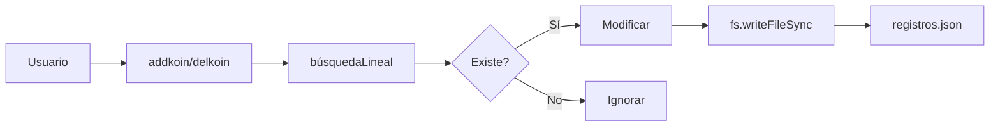

# SPEC: Sistema de Economía

> **Versión**: 1.0.0  
> **Última actualización**: 2026-04-27  
> **Estado**: ✅ Completado

---

## 1. Descripción General

| Atributo | Valor |
|---------|-------|
| Módulo | Economía |
| Archivo principal | `settings/Grupo/Js/reg.js` |
| Archivo de datos | `settings/Grupo/Json/registros.json` |
| Tipos | Monedas, XP, Niveles, Reputación |

---

## 2. Funcionalidades

### 2.1 Agregar Monedas (addkoin)

**Función**: `reg.js:60-71`

```javascript
function addkoin(sender, monto) {
  posicion = buscarPosicion(sender)
  SI posicion existe:
    registro[posicion].dinero += monto
  guardarJSON()
}
```

| Input | Tipo | Descripción |
|-------|------|-------------|
| `sender` | string | JID del usuario |
| `monto` | number | Cantidad a agregar |

### 2.2 Deducir Monedas (delkoin)

**Función**: `reg.js:47-58`

```javascript
function delkoin(sender, monto) {
  posicion = buscarPosicion(sender)
  SI posicion existe:
    registro[posicion].dinero -= monto
  guardarJSON()
}
```

| ⚠️ Advertencia |
|----------------|
| **No verifica saldo suficiente** (puede quedar negativo) |

### 2.3 Obtener Saldo (MoneyOfSender)

**Función**: `reg.js:73-83`

```javascript
function MoneyOfSender(sender) {
  posicion = buscarPosicion(sender)
  SI posicion existe:
    retorno registro[posicion].dinero
}
```

| Retorna | Tipo |
|--------|------|
| `number` | Dinero del usuario |
| `undefined` | Si no existe |

### 2.4 Agregar XP (addXp)

**Función**: `reg.js:138-149`

```javascript
function addXp(sender, monto) {
  posicion = buscarPosicion(sender)
  SI posicion existe:
    registro[posicion].xp += monto
  guardarJSON()
}
```

### 2.5 Obtener XP (xpOfsender)

**Función**: `reg.js:163-173`

```javascript
function xpOfsender(sender) {
  posicion = buscarPosicion(sender)
  SI posicion existe:
    retorno registro[posicion].xp
}
```

### 2.6 Agregar Nivel (addLevel)

**Función**: `reg.js:125-136`

```javascript
function addLevel(sender, monto) {
  posicion = buscarPosicion(sender)
  SI posicion existe:
    registro[posicion].nivel += monto
  guardarJSON()
}
```

### 2.7 Obtener Nivel (levelOfsender)

**Función**: `reg.js:151-161`

```javascript
function levelOfsender(sender) {
  posicion = buscarPosicion(sender)
  SI posicion existe:
    retorno registro[posicion].nivel
}
```

### 2.8 Agregar Reputación (addRep)

**Función**: `reg.js:204-233`

```javascript
function addRep(usuario, monto) {
  usuario = usuario.trim()
  PARA c/u registro:
    SI user.id.trim() === usuario:
      user.rep += monto
  guardarJSON()
}
```

### 2.9 Obtener Reputación (repUser)

**Función**: `reg.js:270-278`

```javascript
function repUser(sender) {
  posicion = buscarPosicion(sender)
  SI posicion existe:
    retorno registro[posicion].rep
}
```

---

## 3. Sistema de Progresión

### 3.1 Niveles y Rangos

**Archivo**: `settings/rangos.json`

| Nivel | Rango | XP Requerida |
|-------|------|-------------|
| 1-5 | 🥊 Novato I-V | 0-5000 |
| 6-10 | 🥉 Bronce I-V | 5000-11000 |
| 11-15 | 🥈 Plata I-V | 11000-21000 |
| 16-20 | 🥇 Oro I-V | 21000-35000 |
| 21-25 | 🦾 Platino I-V | 35000-55000 |
| 26-30 | 💎 Diamante I-V | 55000-80000 |
| 31-35 | 🥋 Maestro I-V | 80000-110000 |
| 36-40 | ⛩ Gran Maestro I-V | 110000-145000 |
| 41-45 | 🐉 Legendario I-V | 145000-185000 |
| 100 | 🥒 Follador Legendario | 1000000+ |

### 3.2 Level Up

**Comando**: `.levelup`

```
REQUISITO: xp >= rxp + 1000

RECOMPENSA:
  - +1 nivel
  - +10 coins
  - +100 XP
  - +1000 rxp (XP requerida para siguiente nivel)
```

---

## 4. Tabla Resumen de Funciones

| Función | Archivo |ínea | Modifica Archivo |
|--------|--------|------|-----------------|
| `addkoin` | reg.js | 60 | ✅ Sí |
| `delkoin` | reg.js | 47 | ✅ Sí |
| `MoneyOfSender` | reg.js | 73 | ❌ No |
| `addXp` | reg.js | 138 | ✅ Sí |
| `xpOfsender` | reg.js | 163 | ❌ No |
| `addLevel` | reg.js | 125 | ✅ Sí |
| `levelOfsender` | reg.js | 151 | ❌ No |
| `addRep` | reg.js | 204 | ✅ Sí |
| `repUser` | reg.js | 270 | ❌ No |
| `addRxp` | reg.js | 175 | ✅ Sí |
| `Rxp` | reg.js | 187 | ❌ No |

---

## 5. Errores Comunes

| Error | Causa | Solución |
|-------|-------|---------|
| Saldo negativo | delkoin sin verificación | Verificar saldo antes de llamar |
| undefined | Usuario no registrado | Verificar con checkOfReg |
| JSON corrupto | Archivo mal formateado | Reparar JSON manualmente |

---

## 6. Diagramas



---

## 7. Notas de Implementación

1. **Sin transacciones**: Cada operación es independiente (sin atomicidad)
2. **Sin validación**: delkoin no verifica saldo
3. **BuscarLineal**: O(n) por cada operación
4. **Persistencia inmediata**: writesync en cada cambio

---

## 8. Referencias

- Módulo: `settings/Grupo/Js/reg.js`
- Datos: `settings/Grupo/Json/registros.json`
- Rangos: `settings/rangos.json`

---

*Documento generado automáticamente - 2026*