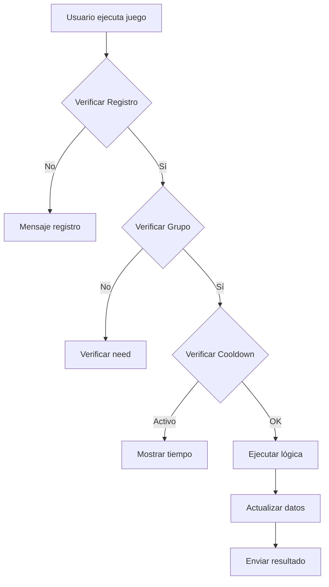

# SPEC: Juegos - Minería, Diario, Ruleta, Tragamondas, Pesca

> **Versión**: 1.0.0  
> **Última actualización**: 2026-04-27  
> **Estado**: ✅ Completado

---

## 1. Descripción General

| Atributo | Valor |
|---------|-------|
| Módulo | Juegos RPG |
| Archivo principal | `index.js`, `Games/Js/mining.js` |
| Comandos | `.minar`, `.daily`, `.ruleta`, `.tragamondas`, `.pescar` |

---

## 2. Minería (.minar)

**Comando**: `index.js:1726`

**Trigger**: `.minar`

**Cooldown**: 24 horas

```
FLUJO:
  1. Verificar isReg
     → NO: mensaje registro → FIN
  2. Verificar isGroup
     → NO: "solo grupos" → FIN
  3. Verificar cooldown (checkMinar)
     → ACTIVO: mostrar tiempo restante → FIN
  4. Establecer cooldown 24h
  5. Generar monto aleatorio (5-10)
  6. Agregar monto a dinero
  7. Enviar resultado
```

| Recompensa | Probabilidad |
|-----------|---------------|
| ₹5-10 | 100% (aleatorio) |

### 2.1 Verificación de Cooldown

```javascript
function checkMinar(sender)
function timeMinar(sender)
function addMinar(cooldown)
function expiredMinar()  // Limpia expirados al iniciar
```

---

## 3. Diario (.daily)

**Comando**: `index.js:1656`

**Trigger**: `.daily`

**Cooldown**: 24 horas

```
FLUJO:
  1. Verificar isReg
  2. Verificar isGroup  
  3. Verificar cooldown (checkDayli)
     → ACTIVO: mostrar tiempo
  4. Establecer cooldown 24h
  5. Agregar 1 moneda
  6. Agregar 5 XP
  7. Enviar resultado
```

| Recompensa | Probabilidad |
|------------|---------------|
| ₹1 | 100% |
| +5 XP | 100% |

---

## 4. Ruleta (.ruleta)

**Comando**: `index.js:1755`

**Trigger**: `.ruleta <apuesta>`

**Cooldown**: 24 horas

**Apuesta máxima**: 5 coins

```
FLUJO:
  1. Verificar args[0]
     → NO: "indique monto" → FIN
  2. Verificar isReg
  3. Validar monto:
     - NO número → "monto válido"
     - > saldo → "no tienes suficiente"  
     - > 5 → "no mayor a 5"
  4. Verificar cooldown (checkRuleta)
     → ACTIVO: mostrar tiempo
  5. Establecer cooldown 24h
  6. Generar resultado:
     - Math.random() < 0.5 → "vive" (gana)
     - Math.random() >= 0.5 → "muere" (pierde)
  7. Aplicar resultado
  8. Enviar mensaje
```

| Resultado | Probabilidad | Efecto |
|----------|-------------|--------|
| Gana | 50% | +₹<apuesta> |
| Pierde | 50% | -₹<apuesta> |

---

## 5. Tragamondas (.tragamondas)

**Comando**: `index.js:1563`

**Trigger**: `.tragamondas`

**Cooldown**: 8 horas

**Costo**: 1 moneda

```
FLUJO:
  1. Verificar isReg
  2. Verificar coins >= 1
     → NO: "no tienes coins" → FIN
  3. Verificar cooldown (checkClaimTraga)
     → ACTIVO: mostrar tiempo → FIN
  4. Establecer cooldown 8h
  5. Descontar 1 moneda
  6. Generar 3x3 símbolos:
     - 60%: fila centro igual
  7. Verificar ganancia:
     - SI: 50% coins (5-10), 50% XP (5-10)
  8. Enviar resultado (3s delay)
```

| Resultado | Probabilidad | Recompensa |
|----------|-------------|------------|
| Gana | 60% | ₹5-10 o XP 5-10 |
| Pierde | 40% | -1 moneda |

**Símbolos**: 🥕🐰🐸🦊🐱🍋🔔🍒🍉🍌

---

## 6. Pesca (.pescar)

**Comando**: `index.js:1809`

**Trigger**: `.pescar`

**Cooldown**: 8 horas

```
FLUJO:
  1. Verificar isReg
  2. Verificar args vacíos
     → CON args: "no pongas palabras"
  3. Verificar cooldown (checkPescar)
     → ACTIVO: mostrar tiempo
  4. Establecer cooldown 8h
  5. Generar resultado aleatorio:
     - delfín (1/6)
     - pulpo (1/6)
     - pez (1/6)
     - pez2 (1/6)
     - pez3 (1/6)
     - zapato (1/6)
  6. Aplicar recompensas
  7. Enviar resultado
```

| Resultado | Probabilidad | Recompensa |
|----------|-------------|------------|
| 🦈 Delfín | ~16.67% | 20 XP |
| 🐙 Pulpo | ~16.67% | ₹8 |
| 🐠 Pez | ~16.67% | ₹4 + 5 XP |
| 🐟 Pez2 | ~16.67% | ₹3 + 3 XP |
| 🐡 Pez3 | ~16.67% | ₹1 + 2 XP |
| 👞 Zapato | ~16.67% | 0 |

---

## 7. Tabla Resumen

| Juego | Comando | Costo | Cooldown | Premio |
|-------|---------|------|---------|--------|
| Minería | `.minar` | 0 | 24h | ₹5-10 |
| Diario | `.daily` | 0 | 24h | ₹1 + 5 XP |
| Ruleta | `.ruleta <ap>` | ≤5 | 24h | ±₹<ap> |
| Tragamondas | `.tragamondas` | 1 | 8h | ₹5-10 o XP |
| Pesca | `.pescar` | 0 | 8h | ₹1-20 + XP |

---

## 8. Validaciones Comunes

```javascript
// Verificar registro
if (!isReg) return enviar("registro")

// Verificar grupo (algunos juegos)
if (!isGroup) return enviar("solo grupos")

// Verificar cooldown
if (checkJuego(sender)) {
  const tiempo = timeJuego(sender)
  return enviar(`Espere ${runtime(tiempo)}`)
}
```

---

## 9. Errores Comunes

| Error | Causa | Solución |
|-------|-------|---------|
| "Espere X" | Cooldown activo | Esperar tiempo |
| "No tienes coins" | Saldo insuficiente | Jugar otros juegos |
| "solo grupos" | Comando en DM | Usar en grupo |

---

## 10. Diagramas



---

## 11. Referencias

- Mining: `index.js:1726`
- Daily: `index.js:1656`  
- Ruleta: `index.js:1755`
- Tragamondas: `index.js:1563`
- Pesca: `index.js:1809`
- Módulo: `Games/Js/mining.js`

---

*Documento generado automáticamente - 2026*